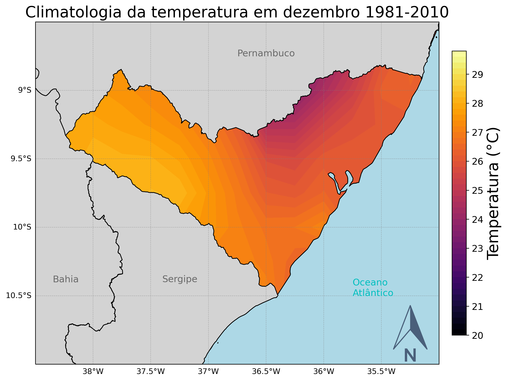

# Plot_NetCDF

```python
import pandas as pd
import numpy as np
import xarray as xr
import matplotlib.colors as colors
import matplotlib.colorbar as colorbar
import matplotlib.pyplot as plt
import cartopy.crs as ccrs
import cartopy.feature as cfeature
import cartopy.io.shapereader as shpreader
from cartopy.feature import ShapelyFeature
from cartopy.mpl.ticker import LongitudeFormatter, LatitudeFormatter
from PIL import Image
```


```python

#Abrindo arquivo .nc
ds = xr.open_dataset('Temp_2m_clima_1981-2010-AL.nc')
t = ds['t2m'] - 273.15
lon, lat = np.meshgrid(t.longitude, t.latitude)
time = ds['time']

#Criando figura e adicionando features
fig = plt.figure(figsize=(10, 8))
ax = plt.axes(projection=ccrs.PlateCarree())
ax.set_extent([-38.5, -35, -11, -8.5], ccrs.PlateCarree())
#ax.add_feature(cfeature.BORDERS)
#ax.add_feature(cfeature.COASTLINE)
#ax.add_feature(cfeature.STATES)
ax.add_feature(cfeature.OCEAN.with_scale('10m'), zorder=2, edgecolor='black', facecolor='lightblue')
#ax.add_feature(cfeature.LAKES, alpha=1.0)
#ax.add_feature(cfeature.LAND)

#Aplicando contorno
im = ax.contourf(lon, lat, t.isel(time=11), 
                 levels=np.arange(20, 30, 0.2), cmap='inferno',
                 transform=ccrs.PlateCarree())

#Lendo arquivos .shp
#shape_AL = ShapelyFeature(shpreader.Reader('AL_UF_2021/AL_UF_2021.shp').geometries(),\
# ccrs.PlateCarree(), zorder=1, facecolor='none', edgecolor='k', linewidth=1.0)
#ax.add_feature(shape_AL)
shape_PE = ShapelyFeature(shpreader.Reader('PE_UF_2021/PE_UF_2021.shp').geometries(),\
 ccrs.PlateCarree(), zorder=2, facecolor='lightgray', edgecolor='k', linewidth=1.0)
ax.add_feature(shape_PE)
shape_BA = ShapelyFeature(shpreader.Reader('BA_UF_2021/BA_UF_2021.shp').geometries(),\
 ccrs.PlateCarree(), zorder=2, facecolor='lightgray', edgecolor='k', linewidth=1.0)
ax.add_feature(shape_BA)
shape_SE = ShapelyFeature(shpreader.Reader('SE_UF_2021/SE_UF_2021.shp').geometries(),\
 ccrs.PlateCarree(), zorder=2, facecolor='lightgray', edgecolor='k', linewidth=1.0)
ax.add_feature(shape_SE)

#Adicionando colorbar para a legenda
cbar = plt.colorbar(im, ax=ax, pad=0.03, fraction=0.033)
cbar.set_label(label='Temperatura (°C)', size=20)
cbar.ax.tick_params(labelsize=12)

#Linhas da grade e Coordenadas geográficas
gd = ax.gridlines(crs=ccrs.PlateCarree(), linestyle='--', color='gray', draw_labels=True, alpha=0.5, linewidth=0.5)
gd.right_labels = False
gd.top_labels = False

ax.set_title('Climatologia da temperatura em dezembro 1981-2010', size=20)
#fazer um ax.text com o texto da variável escrever com as cores das letras azul e o tamanho da fonte 12
ax.text(-35.75, -10.5, 'Oceano\nAtlântico', color='c', size=12)
ax.text(-37.4, -10.4, 'Sergipe', color='dimgray', size=12)
ax.text(-36.75, -8.75, 'Pernambuco', color='dimgray', size=12)
ax.text(-38.35, -10.4, 'Bahia', color='dimgray', size=12)

# Ler o arquivo da imagem com a seta indicando o norte
seta = Image.open("norte.png")
# Adicionar a imagem ao mapa
ax.imshow(seta, extent=[-35.5, -35, -11, -10.55], aspect='auto', alpha=0.7, zorder=3)

plt.savefig('figure.png', dpi=300, bbox_inches='tight')

plt.show()
```


    

    

